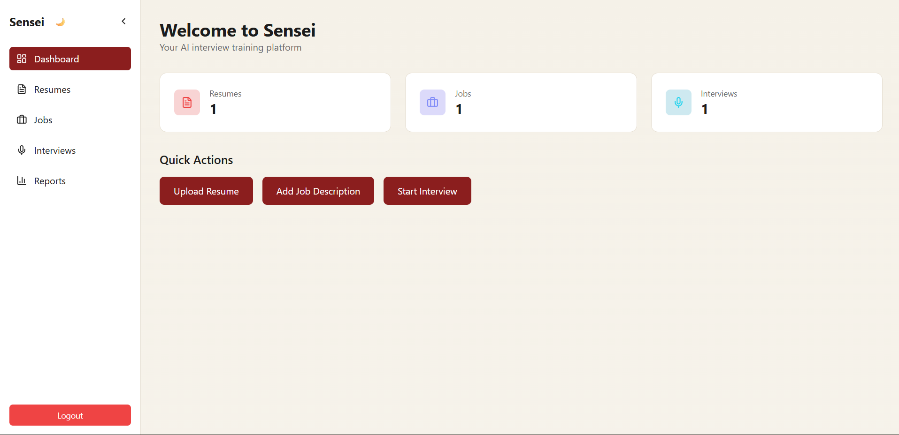
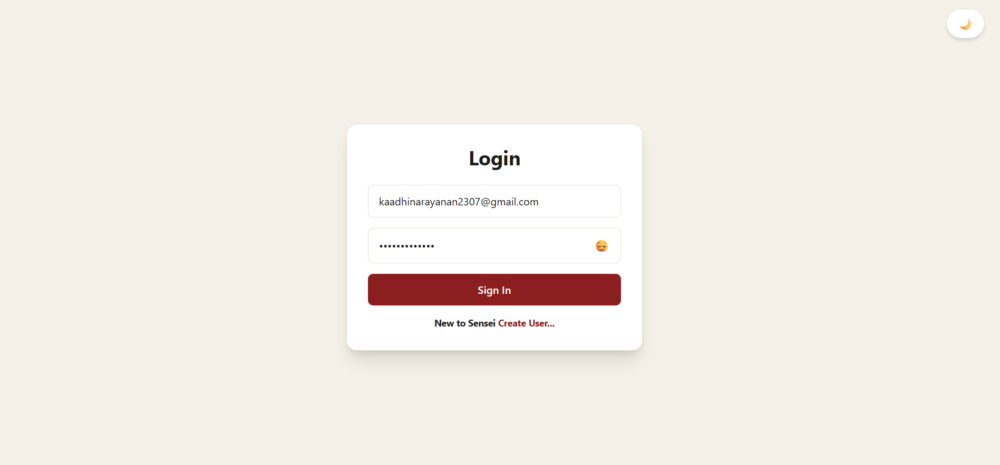
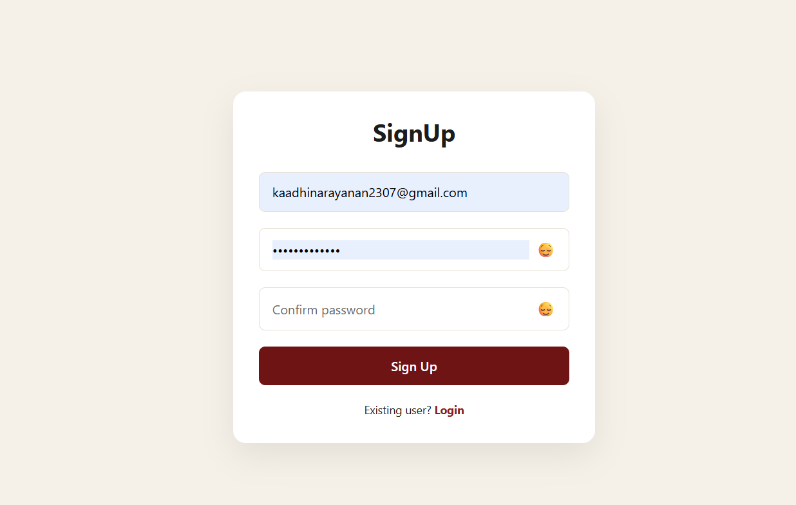
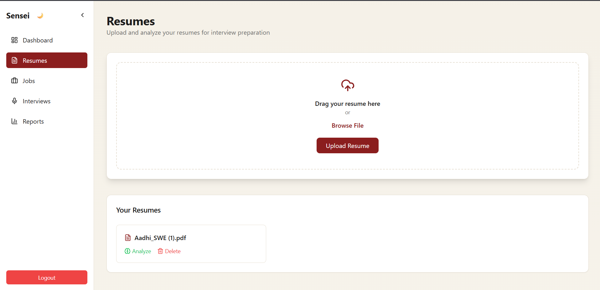
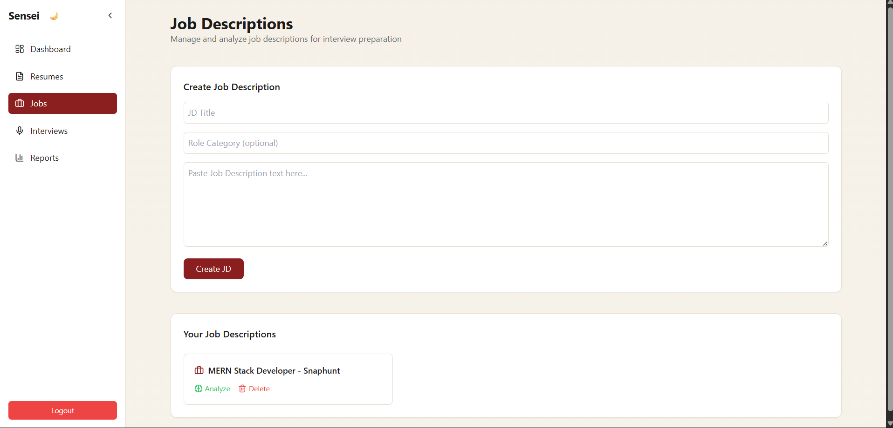
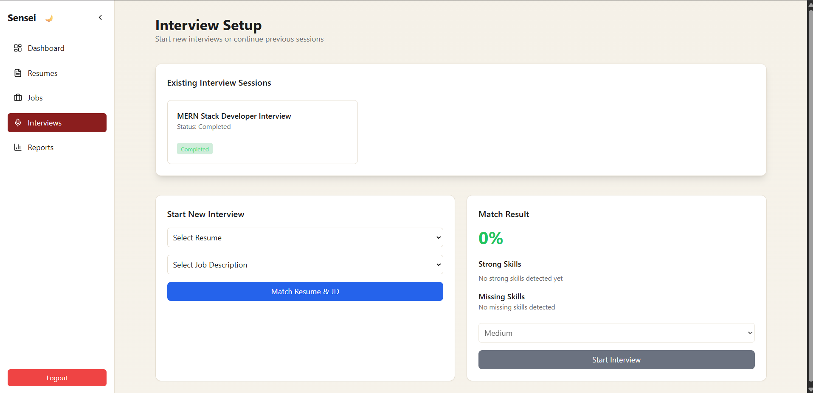
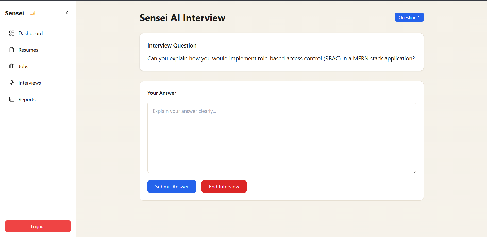
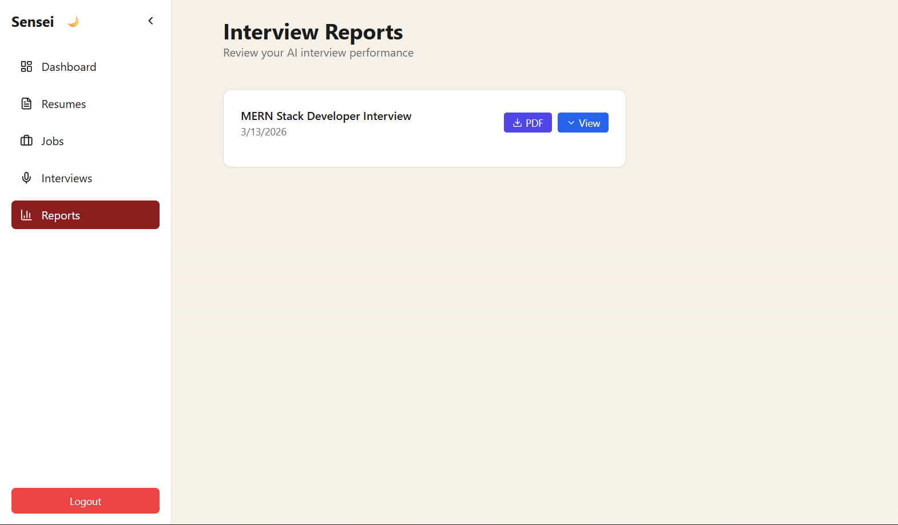

# Sensei – AI Interview Training Platform

<p align="center">
AI-powered platform for practicing technical interviews with adaptive questioning, resume analysis, and performance insights.
</p>

<p align="center">
  
</p>

<p align="center">


</p>

---

## 🌐 Live Demo

**Frontend**  
https://www.sensei-ai.site/

**Backend API Docs**  
https://api.sensei-ai.site/api-docs/

---

## 🚀 Features

- AI-powered interview session generation  
- Resume upload and AI analysis  
- Job description analysis  
- Adaptive interview question engine based on candidate performance  
- AI answer evaluation and scoring  
- Detailed interview performance analytics  
- Downloadable **PDF interview reports**  
- Dashboard with interview statistics and tracking  
- Skill-based question recommendations  
- Secure resume storage using cloud object storage  

---

## 🧠 Adaptive Question Engine

Sensei dynamically adjusts interview difficulty based on candidate performance.

After each answer, the AI evaluates the response and assigns a score.  
The next question difficulty is automatically adjusted based on this score.

Example flow:

```
Medium Question → Score ≥ 8 → Hard Question
Medium Question → Score 5–7 → Medium Question
Medium Question → Score ≤ 4 → Easy Question
```

This creates a **progressive and personalized interview experience**, similar to real technical interviews.

---
## 🔍 Observability

- Structured logging with **Pino** (dev + production)
- Request tracing using unique `requestId`
- AI interaction logging (requests, responses, errors, latency)
- Centralized error handling with **Sentry integration**
- Layered rate limiting (global, auth, AI endpoints)
- File-based logging with rotation (development)

---

## 🏗️ Tech Stack

### Frontend
- React  
- TypeScript  
- TailwindCSS  
- Axios  
- React Router  
- React Hot Toast  
- Lucide Icons  

### Backend
- Node.js  
- Express.js  
- Prisma ORM  

### AI Service
- FastAPI (Python)  
- OpenAI API  

### Database
- PostgreSQL  
- MongoDB  

### Cloud Storage
- Cloudflare R2 (Resume storage)

### Deployment
- Frontend: **Vercel**  
- Backend API: **Railway**  
- AI Service: **FastAPI (Railway)**  
- Database: **PostgreSQL (Railway)** / **MongoDB (MongoDB Atlas)**  

---

## 🧠 System Architecture

```
User
 │
 ▼
Frontend (React + TypeScript)
 │
 ▼
Backend API (Node.js + Express)
 │
 ├── AI Service
 │      └── FastAPI (Python)
 │             └── OpenAI API
 │
 ├── Database
 │      ├── PostgreSQL
 │      └── MongoDB
 │
 └── Cloud Storage
        └── Cloudflare R2
```


## 📸 Screenshots

### Login Page
<p align="center">
  
</p>

### Signup Page
<p align="center">
  
</p>

### Dashboard
<p align="center">
  
</p>

### Resume Upload & Analysis
<p align="center">
  
</p>

### Job Description Creation
<p align="center">
  
</p>

### Interview Setup
<p align="center">
  
</p>

### Interview Session
<p align="center">
  
</p>

### Interview Report
<p align="center">
  
</p>

---

## 📊 Example Workflow

1. User uploads resume  
2. AI analyzes resume and extracts skills  
3. User creates interview session  
4. AI generates interview questions  
5. User answers questions  
6. AI evaluates answers  
7. System generates **performance report + downloadable PDF**

---

## 🚀 Future Improvements (Phase 2)

### AI Improvements
- Voice-based interview simulation  
- AI interviewer avatar  
- In-depth answer analysis with concept-level feedback  
- Behavioral and technical response evaluation  

### Platform Features
- Coding interview environment  
- Company-specific interview preparation  
- Skill progression tracking  
- Interview difficulty levels  

### Analytics
- Confidence scoring per skill  
- Weakness detection across topics  
- AI-driven career recommendations  
- Video-based confidence and body language analysis  

### UX Improvements
- Interview replay system  
- Interview history timeline  
- Gamified learning progress  

---

## 👨‍💻 Author

**Aadhinarayanan Krishnamoorthy**

GitHub  
https://github.com/Aadhikrish23

---

## 📜 License

This project is licensed under the **MIT License**.
